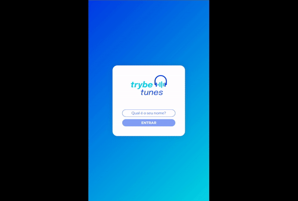

# Trybe Tunes

Essa é uma aplicação React que permite buscar álbuns de variados artistas e bandas, ouvir prévias e favoritar músicas, a partir de um perfil personalizável.
O projeto consome a API pública do iTunes (Apple).

O foco desse projeto foi explorar os ciclos de vida de um componente React, o react-router e a gestão de estados.

[Experimente!](https://react-tunes-rt.vercel.app/)

## Funcionalidades

- Fazer login
- Pesquisar por uma banda ou artista
- Listar os álbuns disponíveis dessa banda ou artista
- Visualizar as músicas de um álbum selecionado
- Reproduzir uma prévia das músicas deste álbum
- Favoritar e desfavoritar músicas
- Ver a lista de músicas favoritas
- Ver o perfil da pessoa logada
- Editar o perfil da pessoa logada


## Demonstração




## Tecnologias utilizadas

React, JavaScript, CSS-modules, API, LocalStorage


## Instalação local

1. Clone o repositório 
```bash
  git clone git@github.com:lzaghi/react-tunes.git
```

2. Entre no diretório 
```bash
  cd react-tunes
```

3. Instale as dependências 
```bash
  npm install
```
4. Inicie o servidor
```bash
  npm start
```

A aplicação estará disponível em ```http://localhost:3000```
    


